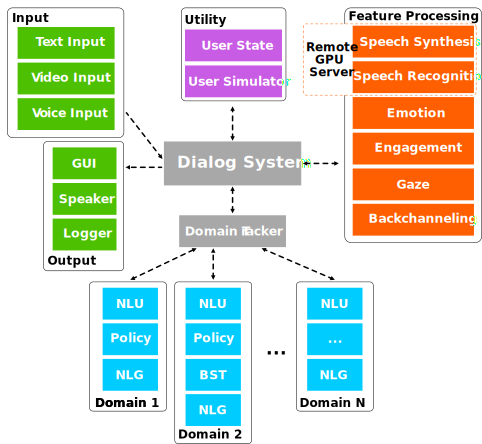

# FAQ

<!-- ## General Information -->

## Who contributed to ADvISER?
- Chia-Yu Li
- Daniel Ortega
- Dirk Väth
- Florian Lux
- Gianna Weber
- Lindsey Vanderlyn
- Maximilian Schmidt
- Michael Neumann
- Moritz Völkel
- Pavel Denisov
- Sabrina Jenne
- Zorica Kacarevic
- Ngoc Thang Vu

## How shall I cite ADvISER
Please see [here](/#how-to-cite).

## Who can I contact in case of problems or questions?
You can ask questions by sending emails to <adviser-support@ims.uni-stuttgart.de>.

You can also post bug reports and feature requests in GitHub issues.

## Can I contribute to the project?
You can post bug reports and feature requests in GitHub issues. You can find the code to ADvISER in [our Git repository](https://github.com/DigitalPhonetics/adviser).

<!-- ## System Specific Information -->

## What are the main features of the system’s framework?

## Which User Actions and System Actions are currently supported by the system?

### User Actions
* **Inform**: User informs the system about a constraint/entity name
* **NegativeInform**: User informs the system they do not want a particular value
* **Request**: User asks the system for information about an entity
* **Hello**: User issues a greeting
* **Bye**: User says bye; this ends the dialog
* **Thanks**: User says thanks
* **Affirm**: User agrees with the last system confirm request
* **Deny**: User disagrees with the last system confirm request
* **RequestAlternatives**: User asks for an alternative offer from the system
* **Ack**: User likes the system's proposed offer
* **Bad**: User input could not be recognized
* **SelectDomain**: User has provided a domain keyword

### System Actions
* **Welcome**: Issue system greeting
* **InformByName**: Propose an entity to the user
*  **InformByAlternatives**: Propose an alternate entity if the user isn't satisfied with the first
* **Request**: Ask for more information from the user
* **Confirm**: Ask the user to confirm a proposed value for a slot
* **Select**: Provide the user with 2 or 3 options and ask the user to select the correct one
* **RequestMore**: Ask the user if there is anything else the system can provide
* **Bad**: If the system could not understand the user
* **Bye**: Say goodbye

## What Emotions and Engagements are currently supported by the system?

### User Emotions
* **happy**
* **angry**
* **neutral**

### User Engagement
* **high**
* **low**

## Which domains are currently supported by ADvISER?
ADvISER currently supports the following domains:

=== "IMS Lecturers"
    Providing information about lecturers teaching at the IMS (for privacy reasons, our database includes fictive information about lecturers and related contact information, however, it serves as an example for a real-world application).

=== "Weather"
    Providing information about the weather.

=== "Mensa"
    Providing information about the menu at the dining hall of the University of Stuttgart.

=== "World Knowledge QA"
    Providing information about common world knowledge.

## Can ADvISER be extended by new modules?
Please follow our [advanced tutorial](/tutorials/advanced).
