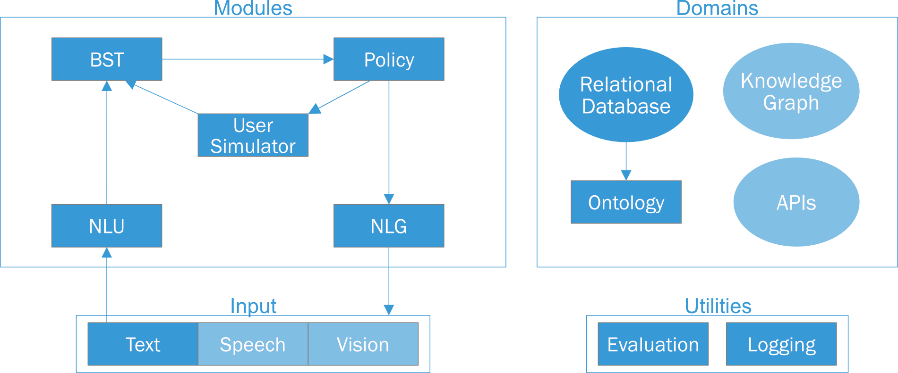

*******************
General Information
*******************

Who contributed to ADvISER?
===========================
- Daniel Ortega
- Dirk Väth
- Gianna Weber
- Lindsey Vanderlyn
- Maximilian Schmidt
- Moritz Völkel
- Zorica Kacarevic
- Ngoc Thang Vu

How shall I cite ADvISER
========================
Please see :ref:`here <home:how_to_cite>`.

Who can I contact in case of problems or questions?
===================================================
You can ask questions by sending emails to adviser-support@ims.uni-stuttgart.de

You can also post bug reports and feature requests (only) in GitHub issues. Make sure to read our guidelines first.

What is the main purpose of ADvISER?
====================================
ADVISER is an open source dialog system framework for education
and research purposes. This system supports multi-domain task-oriented conversations in
English and German. It additionally provides a flexible
architecture in which modules can be arbitrarily
combined or exchanged - allowing for
easy switching between rules-based and neural
network based implementations. Furthermore,
ADVISER offers a transparent, user-friendly
framework designed for interdisciplinary collaboration:
from a flexible back end, allowing easy integration of new features, to an intuitive
graphical user interface supporting non-technical users.

Why should I use ADvISER?
==========================
**Modularity**

    For each module in a classic dialog
    system pipeline (NLU, BST, dialog policy and
    NLG), we provide a handcrafted baseline module,
    additionally we provide a machine learning based
    implementation for the BST and policy. These can be used to quickly assemble
    a working dialog system or as implementation
    guidelines for custom modules. Additionally, because
    all modules inherit from the same abstract
    class, technical users can also easily write their
    own implementations or combinations of modules.

**Flexibility** 

    In contrast to a more static dialog
    system pipeline, we propose a graph structure
    where the user is in control of the modules and
    their order. This level of control allows users to
    realise anything from pipelines to end-to-end systems.
    Even branching scenarios are possible as
    demonstrated by our meta policy which combines
    multiple parallel subgraphs into a single dialog.

**Transparency** 

    Inputs to and outputs from each
    module are captured by automatically generated
    XML interface descriptions, providing a transparent
    view of data flow through the dialog system.

**User-friendliness**

    Technical users have the full flexibility to explore and extend the
    back end; non-technical users can use our defined
    modules for building systems; students from different
    disciplines could easily learn the concepts
    and explore human machine interaction.

Can I contribute to the project?
================================
You can post bug reports and feature requests (only) in GitHub issues. 
You can find the code to ADvISER in our `Git repository <https://github.com/DigitalPhonetics/adviser>`_.
Make sure to read our guidelines first.

Information about the download can be found :ref:`here <home:installation>`.

***************************
System Specific Information
***************************

Are there coding guidelines?
============================ 

The default coding guidelines for this project are the official **pep8** https://www.python.org/dev/peps/pep-0008/ rules.

More specifically:

    - Import adviser modules from corresponding subpackages (e.g. from modules.bst import HandcraftedBST)
    - Import directly from utils, e.g. from utils import SysAct
    - Module names w/ underscore
    - Method names w/ underscore (mark private functions with leading underscore)
    - Descriptive preferred over shorter var names
    - Var names w/ underscore
    - Line length 99 characters
    - Always use type hints: List, Dict, Optional, ..
    - Prioritize readability (shorter methods < 20 lines if possible)

Before checking in your code, please **make sure that your code follows these guidelines**.

Most likely your IDE (e.g. PyCharm) or editor of choice (e.g. Visual Studio Code with the Python plugin) will check these rules automatically and report any violations as warnings.

If not, you can install **pep8** by executing::

    pip install pep8

and check your code with calling::

    pep8 yourfilename.py

(replace 'yourfilename' with the file you want to check).

To check multiple files at once, you can execute::

    pep8 .

in the top level directory of the repository (this will check all `*`.py files in the subdirectories as well)

For more options, see::

    pep8 --help

How can I test new modules?
===========================
The pytest framework makes it easy to write small tests, yet scales to support complex functional testing for applications and libraries.

PyTest should be installed, not built-in:: 

    pip install -U pytest

For more details see the official **pytest** documentation https://docs.pytest.org/en/latest/getting-started.html

Example:

.. code-block:: python
    
    # content of test_sample.py
    
    def func(x):
        return x + 1
    
    def test_answer():
            assert func(3) == 5

If you need to set global variables, use the following fixture with autouse:

.. code-block:: python

    import pytest
    @pytest.fixture(scope="session", autouse=True)
    def execute_before_any_test():
        global myvar
        myvar = 5
        
You can also do other stuff there as this function will be called from pytest before any test.

Run in a terminal from the root folder of adviser the following command:

    python3 -m pytest <optional.py>

pytest makes auto discover if no python file is given, it finds functions in python files that contain with :ref:'test'

What are the main features of the system's framework?
=====================================================

   
   
Which User Actions and System Actions are currently supported by the system?
============================================================================
**User Actions** currently supported by ADvISER are:

    - Inform = 'inform'
    - NegativeInform = 'negativeinform'
    - Request = 'request'
    - Hello = 'hello'
    - Bye = 'bye'
    - Thanks = 'thanks'
    - Affirm = 'affirm'
    - RequestAlternatives = 'reqalts'
    - Ack = 'ack'
    - Restart = 'restart'
    - Bad = 'bad'
    - Confirm = 'confirm'
    
    
**System Actions** currently supported by ADvISER are:

    - Welcome = 'welcomemsg'
    - Inform = 'inform'
    - InformByName = 'inform_byname'
    - InformByAlternatives = 'inform_alternatives'
    - Request = 'request'
    - Confirm = 'confirm'
    - Select = 'select'
    - RequestMore = 'reqmore'
    - Bad = 'bad'
    - Bye = 'closingmsg'
    - ConfirmRequest = 'confreq'
    - Restart = 'restart'

Which domains are currently supported by ADvISER?
=================================================
ADvISER currently supports the following domains:

**IMS Lecturers**

    Providing information about lecturers teaching at the IMS 
    (for privacy reasons, our database includes fictive information about lecturers and related contact information,
    however, it serves as an example for a real-world application).

**IMS Courses**

    Providing information about courses offered at the IMS, 
    e.g. course content, requirements, or locational information. 

Can ADvISER be extended by new modules?
=======================================
Please see :ref:`here <start:getting_started>`.

How can I evaluate the system?
==============================
Please see our `tutorial <../../../adviser/tutorial.html#Evaluation>`_.