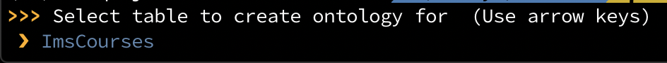
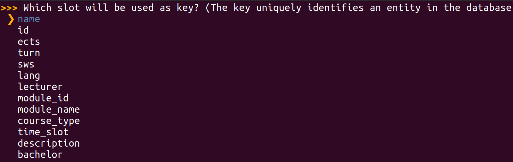
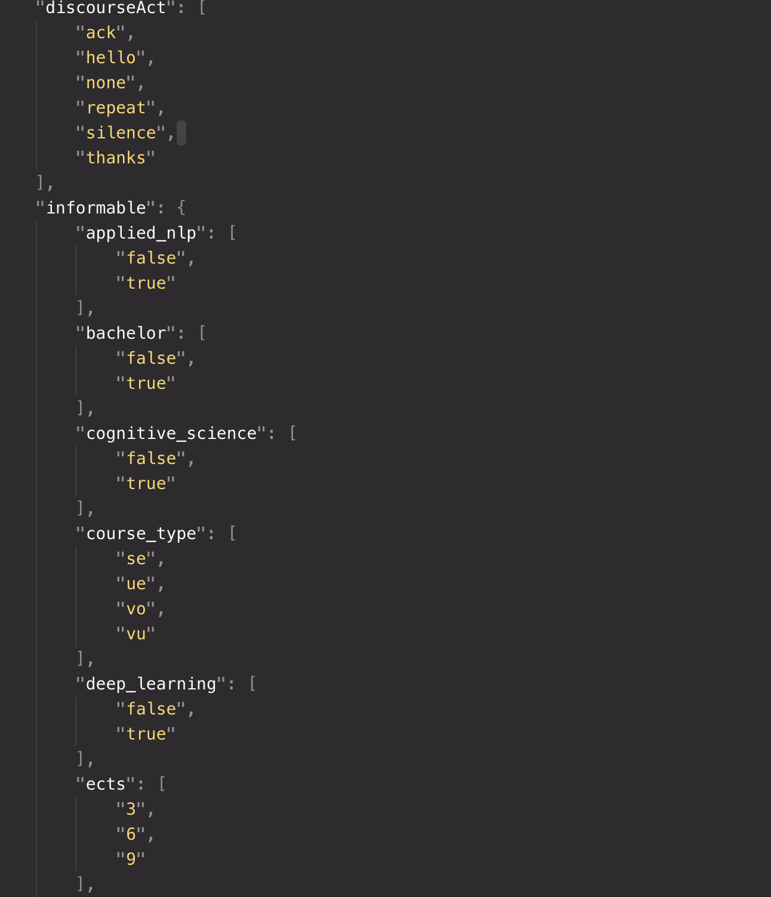
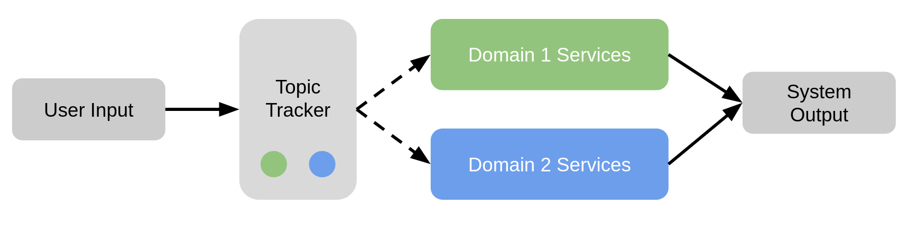
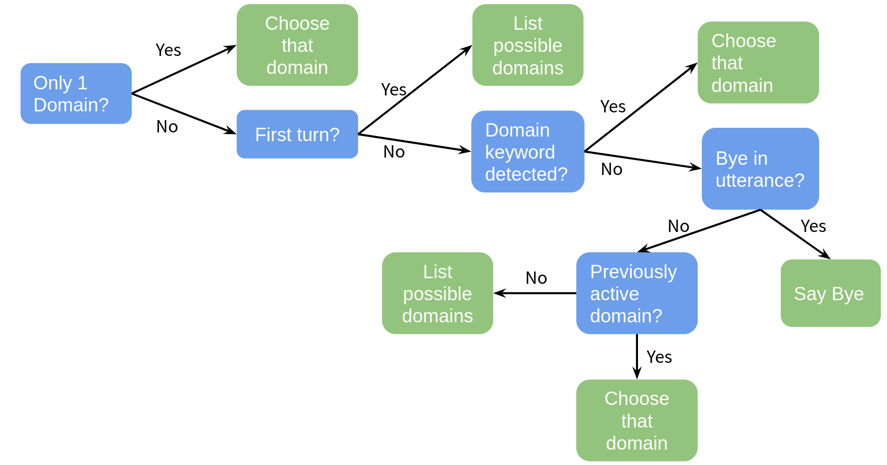

> You can find the Jupyter Notebook in [our GitHub repository](https://github.com/DigitalPhonetics/adviser/blob/master/adviser/tutorials/04_adviser_advanced_topics/4_tutorial_advanced_topics.ipynb).

# Advanced Topics With ADVISER 2.0

Now that you have covered how to work with the existing core services of the ADVISER 2.0 Toolkit, let's discuss some of the more advanced features, such as running a distributed system, emotion detection, how create a new domain, and how to add new services

## Creating a New Domain

### Database
In order to create a new domain, you need an SQLite database with the following properties:
* it contains a single table
* each row represents an entity in the database
* each column in the table represents a slot (entity property such as "name", "color", "last_known_location", etc)
    * binary slots should only have values true or false 

As a note, it is also possible to create a new domain with an API backend instead of a fixed database, but in this case, it may not be possible to use the ontology generation tool shown in the next session.

### Ontology
Once you have a database, the next step is to create an ontology for the new domain. This can be done using the ontology creation tool provided with ADVISER 2.0. The tool is located in the folder `tools/create_ontology.py`

To use the tool, open a terminal and navigate to the folder with the ontology creation tool. The tool can then be called by typing the following command:
```bash
python3 create_ontology.py path/to/your/database/YourDomainName.db
```

As a fist step, you must choose the table you want to use (we will use the ImsCourses database located in resources/databases for demonstration purposes). The interface for this tool can be seen in the image below:



Afterwards, you are asked to name your new domain and then apply the appropriate labels to the different slots. Possible slots will be shown and can be navigated through with the arrow keys. The space bar can be used to select any slots a proposed label applies to. An active selection is indicated by a blue circle.

Possible slot types are
* Informable: information the user can inform the system about
* System requestable: information the system can actively ask the user for
* Requestable: information the user can request from the system


When the system asks you to identify the primary key, this means you should reference the column in your database which uniquely discriminates all database entries (preferably in a human-readable way, not just an index) - in case of the IMSCourses domain, this is the name of the course. 

Selection screens for slots / values look like this:



And the end output should be a file in JSON format like the one shown in the excerpt below:



As a final step the system will ask if you want to copy the database, if your database is not already located inside the folder `resources/databases`, you should select "yes" to this operation, so a copy of your database is where it will be expected when creating a new `Domain` object.

After the tool terminates successfully, check that the following two files were created inside the folders `resources/databases` and `resources/ontologies`:
* \[YourDomainName\].db
* \[YourDomainName\].json


### Domain Object

Once you have your ontology and database, you can create a `Domain` object for your new domain, as seen in the previous tutorial:

```python
from utils.domain.jsonlookupdomain import JSONLookupDomain

your_domain_instance = JSONLookupDomain(name='YourDomainName', 
                            json_ontology_file='resources/databases/YourDomainName.json', 
                            sqllite_db_file='resources/databases/YourDomainName.db')
                            
```

You can than use the object to instantiate the modules that constitute your dialog graph.

### NLU and NLG

Another important thing to remember is to create NLU regexes and NLG templates for your new domain, see the previous tutorial if you have questions on this process.

### Policy

In some cases, a new domain may require a new policy and new `user_acts` or `sys_acts` if the new domain requires functionality not provided by the original policy, it may be neccessary to expand the list of user or system acts. For reference, these lists are shown in the previous sections under the NLU and Policy sections respectively. If new acts are added, the policy must be expanded to be able to accept the new user acts as input and to generate the new system actions as output. This can be done by inheriting from the current policy.

## Creating a New Service

As we saw in Tutorial 2, all of the modules in the ADVISER 2.0 toolkit are children of the Service class. This means in order to create a new module, you need to create a new service. In the previous tutorial we showed an example of how to do this for a simple case. In this section, we will go into more depth on dialog system specifics to consider when creating a service.

### Inheriting from the service class

Step one is always to inherit from the service class. Doing this means that your new service requires a `domain` argument on instantiation, but also that it can take the following optional arguments (which you saw in Tutorial 3):
* `sub_topic_domains`
* `pub_topic_domains`

which allow users to overwrite subsribe/publish topics on instantiation. This can be useful in some cases when combining domain specific services with non domain specific services.


### Determine what methods need to be decorated

The next important step is to consider which methods in your new service should be decorated and what topics it should subscibe to/publish. As a general rule, only methods which will directly interact with other services need to be decorated. If all communication happens inside of a class, normal class methods are sufficient. Another important note, when decorating a method make sure that the list of subscribe topics matches the list of method arguments and that you have checked the topics you subsrcibe to will be published by another method and the topics which you publish will be subscribed to by another method.

### Managing Dialog-Dependent State

Another important concern is dialog dependent state. That is, information which gets tracked within a service over the course of a dialog, but should be reset between dialogs. If you want to initialize/reset per-dialog state or want to perform other actions before the first / after the last dialog turn, you can overwrite the `dialog_start` and `dialog_end` methods provided by the `Service` class. 

These will automatically be called before the start and end of a dialog, so you do not need to worry about decorating them extra. In fact, since topics don't have any guarantees on order of delivery using these methods is preferable to decorating because the methods are guranteed to be called before the first dialog turn and after the last one respectively.

*Since our dialog system might be migrated to multi-session support at some point, we consider it best practice to initialize/reset all dialog-dependent state not in the constructor but rather inside these two methods.*

## Adding Task-specific Feature Extraction

Certain tasks, such as emotion recognition or backchanneling, require specific acoustic and/or visual features as input (see the following sections). To retain maximum modularity, we recommend that feature extraction is separated from the actual task. Therefore, in this section we look at an example of a speech feature extraction module which subscribes to an audio recording and publishes a feature vector.

The feature extractor is a service, i.e. it inherits from the service class:
```python
from services.service import PublishSubscribe
from services.service import Service
from torchaudio.compliance import kaldi

class SpeechFeatureExtractor(Service):
    """Simple feature extractor which uses torchaudio to compute MFCCs."""
    def __init__(self):
        Service.__init__(self)
```

Now, let's create a simple decorated method for feature extraction. Note, in the current ADVISER implementation, 'speech_in' is a tuple that consists of a numpy array representing the audio recording and the sampling rate: (data, sample_rate). This way, everything can be handled in memory without needing to write and delete files. 

```python
    @PublishSubscribe(sub_topics=['speech_in'], pub_topics=['mfcc_features'])
    def speech_to_features(self, speech_in):
        features = kaldi.mfcc(speech_in[0], sample_frequency=speech_in[1])
        
        return {'mfcc_features': features}
```

For the sake of illustration, this example uses [torchaudio](https://pytorch.org/audio/compliance.kaldi.html) to extract [MFCC features](https://en.wikipedia.org/wiki/Mel-frequency_cepstrum). In the current ADVISER implementation, we use the [openSMILE](https://www.audeering.com/opensmile/) toolkit to extract MFCCs and addtionally, [GeMAPS](https://ieeexplore.ieee.org/abstract/document/7160715) features, which are used for emotion recognition.

## Adding Emotion Recognition

The current implementation of ADVISER 2.0 provides a basic module for emotion recognition from speech features.
The prerequisites for this module are:
* A pre-trained model for emotion prediction
* The corresponding acoustic features as input ([see section above](#features))

Implementation and training of a machine learning model for emotion prediction is not part of this tutorial. However, in the current ADVISER 2.0 system, we provide basic multi-layer perceptron models which are trained on the MSP-IMPROV database [1].
In the following code, we see an example emotion recognition class. As with any other module, it inherits from the Service class and uses the PublishSubscribe decorator to communicate with other services. In this example, there is only one model for arousal level prediction involved. Since emotions can be represented in different ways (e.g. arousal/valence levels or categories like 'angry', 'happy', 'sad'), the published topic 'emotion' contains a dictionary which can hold the different predicted representations.

```python
class EmotionRecognition(Service):
    def __init__(self):
        Service.__init__(self)
        self.emotion_dir = os.path.dirname(os.path.abspath(__file__))
        model_path = <<file path to emotion recognition models>>
        self.arousal_model = joblib.load(os.path.join(model_path, 'mlp_audio_arousal.joblib'))


    @PublishSubscribe(sub_topics=["gemaps_features"], pub_topics=["emotion"])
    def predict_from_audio(self, gemaps_features):
        arousal_prediction = self.arousal_model.predict_proba(gemaps_features)

        return {'emotion': {'arousal': arousal_prediction}}
```

Note, this emotion recognition module is a very basic implementation for illustration purposes. It can easily be improved by inserting more sophisticated machine learning models or by adding video features to perform multimodal emotion recognition.


[1] Busso, Carlos, et al. "MSP-IMPROV: An acted corpus of dyadic interactions to study emotion perception." IEEE Transactions on Affective Computing 8.1 (2016): 67-80.

### Using Emotion in a Dialog System

The ADVISER 2.0 currently provides a `UserStateTracker` service which keeps track of the detected user emotion and user engagement level. This module works in conjunction with a naive `EmotionPolicy` service to map user emotion to a system emotional response. Currently this is done with a direct mapping from the recognized user emotion to the same emotion for the system response. This "system emotion" can then be used bye the `HandcraftedEmotionNLG` service to select an affective NLG template in order to react to user emotion. This system can be seen below.


This direct mapping is obviously highly simplistic and may be expanded in future versions of ADVISER.

## Adding Backchanneling

### Backchannel prediction

ADVISER 2.0 comes with an acoustic backchannel module that makes use of a pre-trained backchanneler model and 
MFCC features as input ([see section above](#features)).

The backchanneller implementation consists of a convolutional neural network model based on [1] and trained on the Switchboard benchmark dataset [2]. As input, it receives 13 Mel-frequency-cepstral coefficients from the user’s speech signal. The model assigns one of three categories from the proactive backchanneling theory [3] to each user utterance {no-backchannel, backchannel-continuer and backchannel-assessment}. The predicted category is used to add the backchannel realization, such as Okay or Um-hum, at the begining the next system response.

In the our project, you can find two python files:

* acoustic_backchanneller.py (Definition of the backchannelling module)              
* PytorchAcousticBackchanneler.py (PyTorch implementation that loads the pretrained model for prediction)

We present a code extract from the class acoustic backchanneller (service). As any other module, it inherits from the Service class and uses the PublishSubscribe decorator to communicate with other services. 

```python
class AcousticBackchanneller(Service):
    def __init__(self):
        Service.__init__(self)
        self.speech_in_dir = os.path.dirname(os.path.abspath(__file__)) + '/'
        self.trained_model_path = os.path.join('resources', 'models', 'backchannel') + '/pytorch_acoustic_backchanneller.pt'
        self.load_model()

    def load_model(self):
        self.model = PytorchAcousticBackchanneler()
        self.model .load_state_dict(torch.load(self.trained_model_path))
        self.model.eval()

    @PublishSubscribe(sub_topics=['mfcc_features'],
                      pub_topics=["predicted_BC"])
    def backchannel_prediction(self, mfcc_features: np.array):
        """Takes temporary user utterance wav file and extracts features from it."""
        scaler = preprocessing.StandardScaler()
        mfcc_features = scaler.fit_transform(mfcc_features)
        input_splits = self.split_input_data(mfcc_features)
        prediction = self.model(input_splits).detach().numpy().argmax(axis=1)
        
        # Returning the majority, unless a BC appears,
        # class_int_mapping = {0: b'no_bc', 1: b'assessment', 2: b'continuer'}
        if len(set(prediction)) == 1:
            return {'predicted_BC':  prediction[0]}
        elif 1 in prediction and 2 in prediction:
            ones = len(prediction[prediction==1])
            twos = len(prediction[prediction==2])
            return {'predicted_BC':  1 if ones > twos else 2}
        else:
            return {'predicted_BC': 1 if 1 in prediction else 2}

```

This backchanneller only makes use of acoustic features, however, a more complex module can be implemented, so that it can also profit from ASR trancriptions as shown in [2].


### Integrating backchannel to the system's response

After the backchannel prediction is done, the corresponding backchannel realization should be added to the system response. For simplicity, we decided to add it at the beginning of the system response already generated by the `NLG` module.  This code can be found in the class `BackchannelHandcraftedNLG(HandcraftedNLG)`. Here we have a sample of the most relevant code.

```python
class BackchannelHandcraftedNLG(HandcraftedNLG):
    def __init__(self, domain: Domain, sub_topic_domains: Dict[str, str] = {}, template_file: str = None,
                 logger: DiasysLogger = DiasysLogger(), template_file_german: str = None,
                 language: Language = None):
        HandcraftedNLG.__init__(
            self, domain, template_file=None,
            logger=DiasysLogger(), template_file_german=None,
            language=None, sub_topic_domains=sub_topic_domains)

        # class_int_mapping = {0: b'no_bc', 1: b'assessment', 2: b'continuer'}
        self.backchannels = {
            0: '',
            1: 'Okay. ',
            2: 'Um-hum. '
        }


    @PublishSubscribe(sub_topics=["sys_act", 'predicted_BC'], pub_topics=["sys_utterance"])
    def generate_system_utterance(self, sys_act: SysAct = None, predicted_BC: int = None) -> dict(sys_utterance=str):

        rule_found = True
        message = ""

        try:
            message = self.templates.create_message(sys_act)
            if 'Sorry' not in message:
                message = self.backchannels[predicted_BC] + message
        except BaseException as error:
            rule_found = False
            self.logger.error(error)
            raise(error)
```

The backchanneller does not show variety in its realizations, however, this can be easily implemented if needed.


[1] Daniel Ortega, Chia-Yu Li, NgocThang Vu. "Oh,Jeez! or uh-huh?" A listener- aware backchannel predictor on ASR transcriptions. ICASSP,2020.

[2] D. Jurafsky and E. Shriberg. “Switchboard swbd-damsl
shallow-discourse-function annotation coders manual.”
Institute of Cognitive Science Technical Report, 1997.

[3] Charles Goodwin. 1986. Between and within: Alterna-
tive sequential treatments of continuers and assess-
ments." Journal of Human Studies.


## From Single- to Multidomain

For more complex scenarios, it may make sense to split your dialog system into multiple domains. For example if your goal is to create a university student assistant bot. You may decide that as a start you want your system to help students find information about lecturers and help students to find out what the dining hall (Mensa) is serving. While in theory these two topics could be put together into the same domain, mensa information updates every day so accessing this through a web API is preferable to only having a fixed database. For the lecturers, however there is no web API, and this inofmration remains largely static, so a fixed database is preferable. At this point, since the data sources, and the actual topics of conversation for each topic are so different, giving each its own domain makes sense. But how do we do that?


### Domain Dependent Modules
Services like the Natural Language Understanding, Belief State Tracker and Policy are domain dependent:
they require domain-specific ontology knowledge (e.g. towns for weather, food names for the mensa) or database access to function. Rather than re-implementing these modules for your specific purposes, however, you can instantiate these services with the corresponding domains (one instance per domain).

First we will handle importing all the modules we need and create our domain objects:


```python
# IMPORT DOMAINS AND SERVICES
import sys
import os
from typing import List
import time
sys.path.insert(0, os.path.abspath('../..'))

from services.service import Service, PublishSubscribe, RemoteService
from services.nlu import HandcraftedNLU
from services.bst import HandcraftedBST
from services.policy import HandcraftedPolicy
from services.policy.policy_api import HandcraftedPolicy as PolicyAPI
from services.nlg import HandcraftedNLG
from services.service import DialogSystem
# from examples.webapi.mensa import MensaNLU
from utils.domain.domain import Domain
from utils.domain.jsonlookupdomain import JSONLookupDomain
from utils.logger import DiasysLogger, LogLevel
from examples.webapi.mensa.domain import MensaDomain
from examples.webapi.mensa.nlu import MensaNLU

# CREATE DOMAIN OBJECTS
canteen = MensaDomain()
lecturers = JSONLookupDomain('ImsLecturers')
```

Next let's start creating our Domain Dependent modules:
* `NLU` is domain dependent because it needs access to different regex files depending on the domain


```python
# NLU needs domain to load correct regexe files
lecturer_nlu = HandcraftedNLU(domain=lecturers)
dining_hall_nlu = MensaNLU(domain=canteen)
```

* `BST` is domain dependent because it needs access to an ontology so it knows what the informable requestable slots it needs to track


```python
# BST needs domain to track correct informable/requestable slots
lecturer_bst = HandcraftedBST(domain=lecturers)
dining_hall_bst = HandcraftedBST(domain=canteen)
```

* `Policy` is domain dependent because it needs to know which database to query to determine the next system action


```python
# Policy needs domain to access the correct database
lecturer_policy = HandcraftedPolicy(domain=lecturers)
dining_hall_policy = PolicyAPI(domain=canteen)
```

* `NLG` is domain dependent because it needs to access the correct template files to generate natural language output


```python
# NLG needs to access domain dependent template files
lecturer_nlg = HandcraftedNLG(domain=lecturers)
dining_hall_nlg = HandcraftedNLG(domain=canteen)
```

### Domain Independent Modules

In comparison to the previously shown services, there are also modules in a dialog system that are domain independent, such as ASR and TTS or console input and console output. Regardless of the domain, these modules do the same thing: take in a user input and pass it out as a string. Since these services do not change, domain-independent services only need to be instantiated once. 


An example using console input and console output modules is shown below. Where previously we passed in a domain, here since they are domain independent, we pass in an empty string.


```python
from services.hci.console import ConsoleInput, ConsoleOutput
user_in = ConsoleInput(domain="")
user_out = ConsoleOutput(domain="")
```

### Domain Tracker Module

Once you have created all of domain dependent and independent modules, you will need some way to decide which domain should be active at a given time. That is where the `DomainTracker` module comes in. 
The goal of this module is to take in a domain independent user utterance and map it to the correct domain as shown in the image below:




The domain tracker is something between domain dependent and domain independent. On instantiation, it takes in a list of possible domains which it can forward a user utterance to, although there is no need to create a new `DomainTracker` for each domain in the dialog system. In the current implementation, this module relies on keywords matching, inspired by commercial systems, to determine which domain should be active at any given time. This means that at any time, at most one domain will be active. However a more advanced domain tracker could be implemented to replace this in the future and might even be able to support dialog in multiple domains at the same time.

To determine which domain should be active, the `DomainTracker` follows a series of simple rules shown in the image below: 



If there is only one domain, that domain is always active. If there are more domains, the tracker checks if it is the first turn. If so the system issues a greeting to the user and tells them what domains the dialog system can talk about. If not, the domain tracker checks for domain keywords. If any appear in the user utterance, the first to appear is the domain selected, as the dialog system is not yet capable of handling multiple domains active during the same turn. If there is no keyword, the tracker checks to see if a domain was active the previous turn, if yes, it is assumed that that domain remains active. If there was no active domain in the previous turn, the tracker checks to see if the user said 'bye', if so the tracker will also say 'bye'. If not, the tracker then reminds the user of the domains it is capable of tracking.

This can also be seen in the code below:


```python
""" The domain tracker has to know all domains our application should be able to handle, but not not append domain names to topics by default, so it stores a list of domains, but doesn't forward any of them to the service base class constructor: """
class DomainTracker(Service):
    def __init__(self, domains: List[Domain], greet_on_first_turn: bool = False):
        Service.__init__(self, domain="")
        self.domains = domains
        self.current_domain = None
        self.greet_on_first_turn = greet_on_first_turn

    """ Since service output relies on per-dialog state (turn count, currently active domain), it needs to initialize this state before each new dialog:"""
    def dialog_start(self):
        self.turn = 0

    """ Furthermore, it needs to subscribe to user utterances and forward them (`gen_user_utterance` is short for `generic user utterance`) as a domain-dependent user utterance, or, if no domain is active, publish a system utterance listing all available domains: """
    @PublishSubscribe(sub_topics=["gen_user_utterance"], pub_topics=["user_utterance", "sys_utterance"])
    def select_domain(self, gen_user_utterance: str = None) -> dict(user_utterance=str):
        self.turn += 1
        if self.turn == 1 and self.greet_on_first_turn:
            return {'sys_utterance': "Hello, please let me know how I can help you, I can discuss " +
                    f"the following domains: {self.domains_to_str()}."}

        # if there is only a single domain, simply route the message forward
        if len(self.domains) == 1:
            self.current_domain = self.domains[0]

        # make sure the utterance is lowercase if there is one
        user_utterance = gen_user_utterance
        if user_utterance:
            user_utterance = gen_user_utterance.lower()

        # perform keyword matching to see if any domains are explicitely made active
        active_domains = [d for d in self.domains if d.get_keyword() in user_utterance]

        # Even if no domain has been specified, we should be able to exit
        if "bye" in user_utterance and not self.current_domain:
            return {"sys_utterance": "Thank you, goodbye."}

        # if there are active domains, use the first one
        elif active_domains:
            out_key = f"user_utterance/{active_domains[0].get_domain_name()}"
            self.current_domain = active_domains[0]
            return {out_key: user_utterance}

        # if no domain is explicitely mentioned, assume the last one is still active
        elif self.current_domain:
            out_key = f"user_utterance/{self.current_domain.get_domain_name()}"
            return {out_key: user_utterance}

        # Otherwise ask the user what domain they want
        else:
            return {"sys_utterance": "Hello, please let me know how I can help you, I can discuss " +
                    f"the following domains: {self.domains_to_str()}."}

    """ Convert list of domains to a string for console output """
    def domains_to_str(self):
        if len(self.domains) == 1:
            return self.domains[0].get_display_name()
        elif len(self.domains) == 2:
            return " and ".join([d.get_display_name() for d in self.domains])
        else:
            return ", ".join([d.get_display_name() for d in self.domains][:-1]) + f", and {self.domains[-1].get_display_name()}"
```

As a note, once the `DomainTracker` has selected a domain, this is appended to the output dictionary so that only modules of that same domain will receive the published message.

### Creating a Domain Tracker

The code for creating a `DomainTracker` is nearly the same as any other module. However instead of taking in a `domain` argument as a string or `Domain` object, the `DomainTracker` takes in a `domains` argument which must be a list of domain objects


```python
domain_tracker = DomainTracker(domains=[lecturers, canteen])
```

### Putting it All Together 

The last thing left to do is now to combine all of this into one single dialog system and run it!
* Sending an emty message to `gen_user_utterance` will trigger the domain tracker
* The domian tracker will then see that we're on the first turn with no active domain, thus generating a system message which will inform the user of all available domains (lecturers and canteen)


```python
ds = DialogSystem(services=[user_in, user_out,  # interfaces
                            domain_tracker,
                            lecturer_nlu, dining_hall_nlu,      # NLUs
                            lecturer_bst, dining_hall_bst,      # BSTs
                            lecturer_policy, dining_hall_policy,# Policies
                            lecturer_nlg, dining_hall_nlg,      # NLGs
                    ])
ds.run_dialog({'gen_user_utterance': ""})
```

Alternatively, you can have a look at the `run_chat.py` file
* calling `python run_chat lecturers mensa` from your terminal in the ADVISER main folder will do exactly the same
* you can specify more options, e.g. for using ASR, TTS, etc.

## Running A Distributed Dialog System

If you're relying on computationally intense services, e.g. `ASR` or `TTS` modules, ADVISER 2.0 provdies a way to split up dialog processing so these services can be run remotely, e.g. on more powerful machines, while the rest of the dialog system remains local. 

The easiest way to do this is to use *ssh port-forwarding*, but you can also specify arbitrary IP-adresses (you might have to adapt your router settings for this approach).
Therefore, we will use the port-forwarding approach in the following description.

The good news first: running some modules remotely, does not require any large changes!
1. The first change is that you will need to pass a unique `identifier` to your service constructor; so rather than just taking in a `domain` your service will also need to take in an `identifier` as shown below:

```python
class ConcatenateServiceWithDomain(Service):
    """ new here: identifier argument"""
    def __init__(self, domain: str = "mydomain", identifier: str = None):
        """ NEW: domain name! """
        Service.__init__(self, domain=domain, identifier = identifier)

    """ nothing changes here """
    @PublishSubscribe(sub_topics=["A", "B"], pub_topics=["C", "D"])
    def concatenate(self, A: int = None, B: str = None) -> dict(C=str,D=str):
        print("CONCATENATING ", A, "AND ", B)
        result = str(A) + " " + B
        if A == 3:
            return {'D': result}
        else:
            return  {'C': result}
```

2. Next create an instance of your service with an identifier of your choosing in a script *on your remote machine*; 
    * The only important thing when choosing the identifier is that you don't use the same identifier for two different service instances. But it is recommended that the name is at least somewhat descriptive.
3. _In the same script,_ call this services's `run_standalone()` method. This will kickoff a registration routine with the dialog system instance we're going to run on your local machine

```python
concatenate_service = ConcatenateServiceWithDomain(identifier="myconcatenateservice1")
concatenate_service.run_standalone()
```

4. On *your local machine* which is going to run the dialog system, create a placeholder, `RemoteService` (This is really just a dummy class storing the identifier). This allows the remote service to register with the dialog system; important is that you use *the same* identifier here as you used to create the remote service
5. Then, go ahead and instantiate your dialog system, providing the remote service intance instead of the real service to the service list

```python
# create dummy service
remote_concatenate_service = RemoteService(identifier="myconcatenateservice1")

# pass dummy service in as part of dialog system
ds_with_remote = DialogSystem(services=[remote_concatenate_service, # remote service placeholder
                            print_service])             # local print service
```

From here on, you can call your dialog system with the usual `run_dialog(...)` routine

But to be able to connect to the remote machine, you need to forward the required ports.
For this, on your local machine, call port forwarding for
* subscriber port (default: 65533)
* publisher port (default: 65534)
* remote register port (default: 65535)

```bash
ssh -fNR 65533:localhost:65533 adress.to.your.remote@machine
ssh -fNR 65534:localhost:65534 adress.to.your.remote@machine
ssh -fNR 65535:localhost:65535 adress.to.your.remote@machine
```

If those ports are already in use on your machine, you may change them explicitly in the `Service` *AND* `DialogSystem` constructors, just be consistent. See the docstrings on these classes for more information.

Once you start the `concatenate_service.run_standalone()` on your remote machine and the `ds_with_remote.run_dialog(...)` on your local machine, you will see notifications on the terminal giving you information about the connection state between your local and remote services. 

If you want to have a look at another example (with both services running on the same machine, so you don't need to call ssh for this), look at the `run_chat.py` file with `--gui` option enabled: this starts a webserver as a remote service connecting to the dialog system.


```python

```
