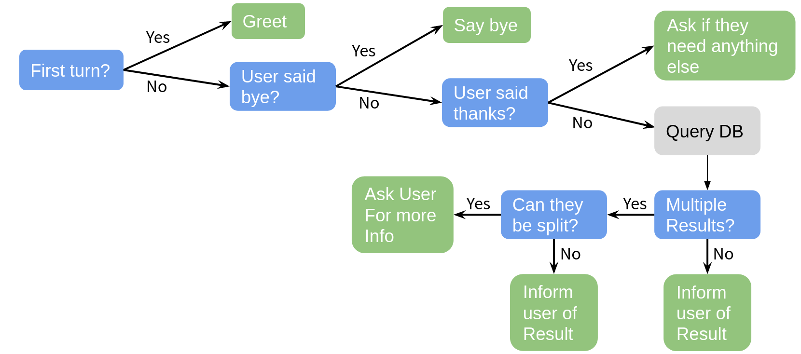
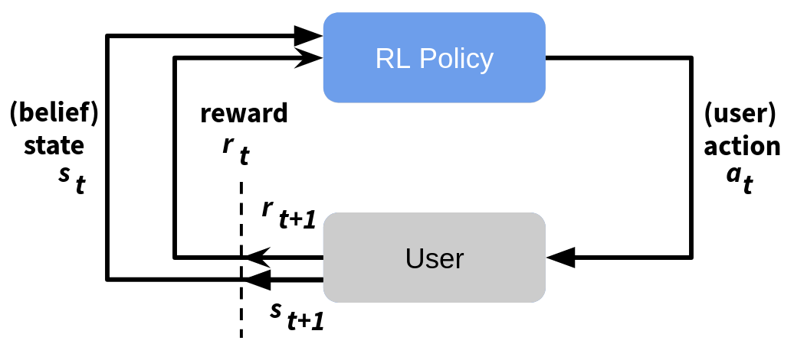

> You can find the Jupyter Notebook in [our GitHub repository](https://github.com/DigitalPhonetics/adviser/blob/master/adviser/tutorials/03_adviser/3_intro_to_adviser.ipynb).

# Task Oriented Dialog Systems with ADVISER 2.0

Already we have seen a little bit how services operate and the basic modules needed to make a dialog system. In this tutorial, we will introduce service based implementations of these modules which come as part of the ADVISER 2.0 toolkit.


```python
# FIRST SET UP ENVIRONMENT

import sys
import os
from typing import List
import time
sys.path.append(os.path.abspath('../..'))

from utils.topics import Topic
from services.service import Service, PublishSubscribe, RemoteService

from utils.domain.domain import Domain
from utils.domain.jsonlookupdomain import JSONLookupDomain
from utils.logger import DiasysLogger, LogLevel

from services.hci import ConsoleInput, ConsoleOutput
from services.nlu import HandcraftedNLU
from services.bst import HandcraftedBST
from services.policy import HandcraftedPolicy
from services.nlg import HandcraftedNLG
from services.domain_tracker import DomainTracker

from services.service import DialogSystem

from torch.utils.tensorboard import SummaryWriter
from services.policy.rl.experience_buffer import NaivePrioritizedBuffer
from services.simulator import HandcraftedUserSimulator
from services.policy import DQNPolicy
from services.stats.evaluation import PolicyEvaluator
```

## Domains, Ontologies, and Databases/APIs

Since this is a tutorial about task-oriented dialog systems, we need to introduce the concept of a domain here.
A domain is a limited topic of conversation, e.g. weather, lecturers, or restaurants. In the context of the ADVISER 2.0 toolkit, a domain is defined by an ontology - which describes the types of entities which can be discussed in a domain, their properties, and which properties the user and system can ask after - and a database which can be queried by the system to anser user requests.

### Databases/APIs

When we discuss task oriented dialog systems in this tutorial, we primarly mean systems where the user is trying to find an appropriate entity and/or information about a given entity's properties. For example, a user is trying to find the best superhero to save their city and once they find one, they want to know their last known location. To enable this, however, the system needs access to a database (or web API) which stores this kind of information.  In the rest of this tutorial, we will work under the assumption that our dialog systems have access to an SQLite database which contains all relevant information for a domain.

### Ontology

Ontologies are responsible for defining what things (entities and their properties) can be discussed in a given domain (topic).
Below is an example ontology for a superhero domain. The *entities* in this domain are superheroes, and their properties include things such as *name*, *primary_uniform_color*, *main_superpower*, *last_known_location*.
These properties are then split into three (overlapping) categories:
* **informables:** Properties the user can tell the system to help accomplish their goal
    * eg. constraints to help them find the right superhero for their job
* **requestables:** Properties the user can ask the system about to find out more information about an entity
    * eg. "what is their secret identity?" something that only makes sense after an entity has been suggested
* **system requestables:** Properties the system can ask the user for to help it figure out what entity best fills the user's goal

The general properties (loyalty, name, etc.) are called slots, and the specific instances of a slot ("Avengers", "Aqua Man", etc.) are called values. As one of the ontology's main purposes is to support in natural language understanding and a user will only provide values for *informable* slots, these are the only values which must be listed in the ontology.


```python
{
    "informable": {
        "loyality": [
            "Avengers",
            "Justice League",
            "Guardians of the Galaxy",
             ...
        ],
        "main_superpower": [
            "Claws",
            "Gadgets",
            "Magic",
             ...
        ],
        "name": [
            "Aqua Man",
            "Batman",
            "Black Widow",
             ...
        ],
        "primary_uniform_color": [
            "Black",
            "Blue",
            "Yellow",
             ...
        ]
    },
    "key": "name",
    "requestable": [
        "name",
        "primary_uniform_color",
        "main_superpower",
        "last_known_location",
        "loyality",
        "description",
        "real_name"
    ],
    "system_requestable": [
        "primary_uniform_color",
        "main_superpower",
        "loyality"
    ]
}
```


    {'informable': {'loyality': ['Avengers',
       'Justice League',
       'Guardians of the Galaxy',
       Ellipsis],
      'main_superpower': ['Claws', 'Gadgets', 'Magic', Ellipsis],
      'name': ['Aqua Man', 'Batman', 'Black Widow', Ellipsis],
      'primary_uniform_color': ['Black', 'Blue', 'Yellow', Ellipsis]},
     'key': 'name',
     'requestable': ['name',
      'primary_uniform_color',
      'main_superpower',
      'last_known_location',
      'loyality',
      'description',
      'real_name'],
     'system_requestable': ['primary_uniform_color',
      'main_superpower',
      'loyality']}


This information is useful to e.g. NLU and Policy:

* A regular expression based NLU can match known values from the ontology against user input
    * e.g. is `italian` in the user input or a synonym defined in the NLU?
        * if so, this could be an inform act for the slot food
* A policy can construct actions based on the slots
    * e.g. slot food is requestable and informable:
        * `inform_food`
        * `request_food`

### The Domain Class
In the ADVISER 2.0 Toolkit, domains are subclasses of `utils.domain.domain.Domain`.
The `Domain` class provides an abstract interface for connecting to the ontology and database associated with a domain e.g. the weather domain would provide means to contact a WebAPI for querying with user-specified constraints like `location, day,...` or could provide access to the ontology so the system would know what system requestable slots existed in the weather domain.

In thins domain, rather than working with the abstract Domain class, we will primarily be using the class `JSONLookupDomain`, a subclass which provides querying functionality for an `SQLite-Database` (found in `resources/databases`) and an  access to an ontology file (found in `resources/ontologies`) in JSON-format.

**Example:**

Let's create an example domain. For this we'll work with a domain called `superhero` which allows users to find the correct superhero for whatever problem is at hand. As mentioned domains require an ontology and a database to define them, therefore as we instantiate a new Domain, we will pass both of these is as files. If the ontology and database file names follow the following format:
* `ontologies/{domain_name}.json`
* `databasees/{domain_name}.db`
then only the `domain_name` is necessary to pass to the `JSONLookupDomain` object to instantiate it as shown below:


```python
# Here we can instantiate the domain with just the name string since the paths to our ontology
# and database files follow the correct pattern
super_domain = JSONLookupDomain(name="superhero")
```

### Topics and Domains

If you're providing domain-objects (or, equivalently, domain name strings) to a `Service` constructor, all subscribed and published topics for this service will implicitly append the domain name to allow for multi domain dialog systems. The exact reasons for this will be explained in more depth in the *mutlidomain* section of the next tutorial.

Let's alter our `ConcatenateService` to accept a domain name:


```python
class ConcatenateServiceWithDomain(Service):
    def __init__(self, domain: str = "mydomain"):
        """ NEW: domain name! """
        Service.__init__(self, domain=domain)

    @PublishSubscribe(sub_topics=["A", "B"], pub_topics=["C", "D"])
    def concatenate(self, A: int = None, B: str = None) -> dict(C=str,D=str):
        """ NOTE: This function did not change at all """
        print("CONCATENATING ", A, "AND ", B)
        result = str(A) + " " + B
        if A == 3:
            return {'D': result}
        else:
            return  {'C': result}
```

If we would run the dialog system example above again, replacing the old `ConcatenateService` with the new `ConcatenateServiceWithDomain`, we would observe no more prints from it and also no more messages to topics `C` and `D`.
This is because the toics for `ConcatenateServiceWithDomain` were internally remapped to:
* `A` -> `A/mydomain`
* `B` -> `B/mydomain`
* `C` -> `C/mydomain`
* `D` -> `D/mydomain`

Subscribers perform *prefix-based topic matching*, that means in this case:
* `A/mydomain`is NOT a prefix of `A` - no messages are received when publishing to `A` (or `B` or any other topic here)
* same argument holds for `B`

However: if `concatenate` would be called, we would see output by `PrintService`! This is because
* `concatenate` publishes to `C/mydomain` and `PrintService` subscribes to `C`
    * `C` is a prefix of `C/mydomain`! 
* same argument holds for `D`

If you provide all your services with the same domain, you're not going to experience any problems and do nothave to worry about these internal details in any way. However, in case you want to 
* go multidomain (see next tutorial)
* combine domain-agnostic with domain-aware services (eg. a console input module and an NLU module)
* change routing behaviour of our provided services without subclassing them and overwriting the respective functions
the `Service` constructor offers a way to overwrite topics on instantiation:

```python
class Service:
    __init__(domain: Union[str, Domain] = "", sub_topic_domains: Dict[str, str] = {}, pub_topic_domains: Dict[str, str] = {}, ...)
```

* `sub_topic_domains` is a mapping for overwriting subscriber topics
    * `key`: the original topic as given in the `PublishSubscribe`-decorator
    * `value`: the domain name to append
        * if `len(value) > 0 `: the value will be appended to the subscribed topic and a slash: `key/value`
        * if `len(value) == 0`: empty domain, subscribed topic will be simply: `key`
* `pub_topic_domains` works analogously

So, if we change our constructor as follows:


```python
class ConcatenateServiceWithDomain(Service):
    def __init__(self, domain: str = "mydomain", 
                       sub_topic_domains = {'A': '',
                                            'B': ''}):
        """ NEW: domain name! """
        Service.__init__(self, domain=domain)

    @PublishSubscribe(sub_topics=["A", "B"], pub_topics=["C", "D"])
    def concatenate(self, A: int = None, B: str = None) -> dict(C=str,D=str):
        """ NOTE: This function did not change at all """
        print("CONCATENATING ", A, "AND ", B)
        result = str(A) + " " + B
        if A == 3:
            return {'D': result}
        else:
            return  {'C': result}
```

everything will work again, meaning we will observe prints and published messages to `C` and `D` again, because we explicitly overwrite the appended domain with the empty string
* `A/mydomain` -> `A`
* `B/mydomain` -> `B`

Another way to alter topics is to append domain strings manually in the return dictionary of any `Publish/Subscribe` function (Note: *This only works, if you didn't provide a domain (or domain name) to the service base class constructor*.):
You may append any domain string to the dictionary keys, seperated by a slash: `/`.

We could e.g. alter our `ConcatenateService` class:


```python
class ConcatenateService(Service):

    @PublishSubscribe(sub_topics=["A", "B"], pub_topics=["C", "D"])
    def concatenate(self, A: int = None, B: str = None) -> dict(C=str,D=str):
        print("CONCATENATING ", A, "AND ", B)
        result = str(A) + " " + B
        if A == 3:
            return {'D/domain1': result}
        else:
            return  {'C/domain2': result}
```

Now, our `ConcatenateService` gets all messages for topics starting with `A` and `B` (and independent of their domain) again, like in our very first `ConcatenateService` example.
But, on the publishing side, we're now publishing to two different domains, `domain1` and `domain2`, by appending these domain names explicitly after the topic followed by the topic-domain-seperator: `C/domain2` and `D/domain1`.

Equipped with these insights into the inner workings of the message routing mechanism, we can evolve our tutorial system to a multi-domain dialog system in the following chapter.

## Automatic Speech Recognition (ASR)

To support spoken dialog systems, the ADVISER 2.0 toolkit provides an ASR module which converts spoken user utterances to text. In the current implementation, we provide the end-to-end ASR model for English language based on Transformer neural network architecture, however the exact ASR system can be swapped out to support other languages or architectures. We use the end-to-end speech processing toolkit [ESPnet](https://arxiv.org/abs/1804.00015) and the IMS-speech English multi-dataset [recipe](https://arxiv.org/abs/1908.04743). The system was trained on LibriSpeech, Switchboard, TED-LIUM\~3, AMI, WSJ, Common\~Voice\~3, SWC, VoxForge, and M-AILABS datasets. The output of the ASR model is a sequence of subword units, which include single characters as well as combinations of several characters, making the model lexicon independent and thus able to handle unseen words. 

### Using the Speech Recognition Module

To use the ASR module, provided in the ADVISER 2.0 toolkit, requires three classes:
* `SpeechRecorder`: responsible for recording the user input
* `SpeechInputFeatureExtracter`: responsible for feature extraction from recorded input
* `SpeechInputDecoder`: responsible for converting input features to subword units

The functionality is broken up in this way to allow other modules, such as the emotion recognition and backchanneling modules which will be seen in Tutorial Four, to also make use of the data extracted at each step.

**Example:**

To create instances of each of these three classes, see the code below

**NOTE:** This only works if you have installed the requirements for the multimodal system (they are large, so this is not recommended if you will only be working with text)


```python
from services.hci.speech import SpeechInputDecoder
from services.hci.speech import SpeechInputFeatureExtractor
from services.hci.speech import SpeechRecorder

conversation_log_dir = "tutorial_logs"
use_cuda = False

recorder = SpeechRecorder(conversation_log_dir=conversation_log_dir)
speech_in_feature_extractor = SpeechInputFeatureExtractor()
speech_in_decoder = SpeechInputDecoder(conversation_log_dir=conversation_log_dir, use_cuda=use_cuda)
```

## Rule-based Natural Language Understanding (NLU)

### Semantic representation of user actions

The NLU module is responsible for mapping natural language user input to a machine readable semantic frame representation. In this case the semantic frame is composed of up to three parts:
* <font color="red"><i><b>intent</b></i></font>: which determines what type of action the user wants to perform (eg. "hello", "inform", "request", etc.)
* <font color="purple"><i><b>slot</b></i></font>: type of entity property the user is talking about (eg. "name", "super_power", etc.)
* <font color="blue"><i><b>value</b></i></font>: exact value of the entity property (eg. "Superman", "super strength", etc.)

For example the following utterances could be mapped to to the following intents:
* "Hello" $\rightarrow$ <font color="red"> <i><b>hello</b></i></font>()
* "I want a superhero who wears blue" $\rightarrow$ <font color="red"> <i><b>inform</b></i></font>(<font color="purple"><i><b>primary_uniform_color</b></i></font>=<font color="blue"> <i><b>"blue"</b></i></font>)
* "What is the hero's secret identity? and their team affiliation?" $\rightarrow$ <font color="red"><i><b>request</b></i></font>(<font color="purple"><i><b>secret_identity</b></i></font>), <font color="red"><i><b>request</b></i></font>(<font color="purple"><i><b>loyalty</b></i></font>)


Slots and values are defined in the ontology, but the intents which the system currently expects are found in the file `utils/useract.py` and listed here below:
* `Inform`: user provides system with new constraints (eg. "speed" as a super power)
* `NegativeInform`: user tells system new negative constraint (eg. "not speed" as a super power)
* `Request`: user asks system for value of a slot (eg. "what is the super power?")
* `Hello`: user greets system
* `Bye`: user ends session
* `Thanks`: user thanks system
* `Confirm`: user confirms system utterance (eg. "yes, I do want super speed")
* `Deny`: user denies system utterance (eg. "No, I do not want super speed")
* `RequestAlternatives`: user asks for other entities that meet their constraints besides the one the system recommended (eg. "is there anyone else besides the Flash?")
* `Bad`: user utterance couldn't be parsed to any other act
* `SelectDomain`: only needed for multidomain systems, user says keyword associated with starting the domain 

These intents can be broken down into two sections: General and Domain-Specific. General acts are those like "Hello" and "Bye" which do not have slots or values associated with them and their regexes remain the same regardless of the domain.

### Specifying rules

In order to understand the user input, one can specify a list of possible natural language realisations for each user act. For example, the user act `hello()` could be expressed by saying <i>Hello</i>, <i>Hi</i> or <i>Hey</i>.
A common way of specifying these rules computationally is to create regular expressions. For example, the dialogue agent could recognise the user act `hello()` if the user input string matches the regular expression `(hello|hi|hey)`.

However, it would be time-consuming and messy to write a list of natural language realisations for all possible combinations of intent, slot and value.
Therefore, we created a new syntax which allows you to reduce the number of rules by creating functions so that you only need to write a rule once and can simply apply it to all needed slots/values. In the following subsections, we present the most important parts of this syntax.

#### 1 General syntax

The syntax uses keywords and indentation to create a nested command structure. This means that each line represents one command and each command starts with a keyword identifying the command type. Commands have a "block level" which is represented by their number of leading spaces (Level 0: 0 spaces, Level 1: 4 spaces, Level 2: 8 spaces, ...).

Rule and function declaration commands are Level 0 commands. Any other commands can be inserted at any level >0 and are automatically added to their "parent" command. A parent command is the last command on the current level -1. In the following example, Command2 is added to Command1, Command4 is added to Command3 and Command5 is added to Command4.

```
Command1 arguments
	Command2 arguments
Command3 arguments
	Command4 arguments
		Command5 arguments
```

#### 2 Commands

Currently, the ADVISER NLU syntax provides five possible commands. Each command individually defines what its arguments have to look like and what kind of child commands it allows. This section will show how to use the commands.

##### 2.1 Rule

The `rule` command specifies a mapping from a regular expression to a specific intent (user act). The command itself consists of the keyword "rule" and a description of the user act as `intent()` for user acts which do not contain slots (e.g. `hello()`, `bye()`) or `intent(slot)` for user acts with a slot (e.g. `inform(primary_uniform_color)`. The `regex` command can later be used as a child command to add information about the user utterances accepted and the slot's value.

Regarding the child commands, a rule can have an infinite amount of child commands. These include the regular expressions for each intent and below those, any exceptions and additions that need to be specified. Exceptions are checked in the order of their appearance.

**Note:** General user acts (those which do not take slots or values as input) are not autogenerated. If you want to edit these, you may do so directly in the file `resources/nlu_regexes/GeneralRules.json`, however be careful as this file is currently shared across all domains.

##### 2.2 Regular Expression

The `regex` command specifies a regular expression should map to the user act specified in the current rule block. RegEx commands consist of the keyword "regex" and a string wrapped by double quotes. They are usually added as child commands to rules, functions, exceptions and additions.

The following example shows a valid rule specification, which matches to either "hero" or "superhero" and both the American and British spellings of the word "color".
```
rule request(primary_uniform_color)
    regex "what is the( super)?hero's uniform colo(u)?r\?"
```

It is also possible to add multiple regular expressions to rule in order to account for more varied user utterances without making the regular expressions too complicated.
```
rule request(primary_uniform_color)
    regex "what is the( super)? hero's uniform colo(u)?r\?"
    regex "what is the colo(u)?r of the( super)? hero's uniform\?"
    regex "which colo(u)?r does the( super)? hero wear\?"
```

For user acts such as `inform`, we also need to have access to the slot's value. The value can be accessed in the regular expression using curly braces.
```
rule inform(primary_uniform_color)
    regex "the colo(u)?r should be {primary_uniform_color}"
```
This way, we can specify one rule for each value of primary_uniform_color. For example, if the user types _the colour should be green_, the system detects the user act `inform(primary_uniform_color=green)`.

Note: RegEx commands cannot take any child commands.

##### 2.3 Exceptions

Exceptions can be called inside a rule command/function to override the default messages. Exceptions consist of the keyword "if" and take a constraint as an argument. A constraint can currently only match the pattern `variable = "string"`. Exceptions particularly make sense in cases where you might prefer to use a synonym rather than the exact value in the database. For example, if a database stores colors by hexadecimal code, the user cannot be expected to know the code for each color. Therefore, we could add an exception using the common name for the color, so that instead of expecting colors in hexadecimal, the system will only recognize the common name for the color.
```
rule inform(primary_uniform_color)
    regex "the colo(u)?r should be {primary_uniform_color}"
    if primary_uniform_color = "#ff11bb"
        regex "the colo(u)?r should be pink"
```

**Note**: Exception commands can take the same child commands as rule commands.

##### 2.4 Additions

Additions work very similar to exceptions. The only differences are that "add_if" is used as the keyword and that the messages of the addition command do not override the regexes of the parent command, but instead add possible regexes to the existing ones, this is in particularly well suited to adding synonyms. In the following example, we allow the user to also say _cyan_ or _blue_ as a way to map to the `primary_uniform_color` _blue_.
```
rule inform(primary_uniform_color)
    regex "(the colo(u)?r|) should be {primary_uniform_color}"
    if primary_uniform_color = "#ff11bb"
        regex "the colo(u)?r should be pink"
    add_if primary_uniform_color = "blue"
        regex "the colo(u)?r should be cyan"
        
```

**Note:** Addition commands can take the same child commands as rule commands.

##### 2.5 Functions

Functions are similar to rules. They can take an arbitrary number of parameters and return a regular expression (or normal string). The function command consists of the keyword "function" and the function description using the pattern `function_name(argument_one, argument_two)`. Functions are particularly useful to improve the structure of your files. In the previous example, we have added _cyan_ to be a synonym of _blue_. If we want to add synonyms for all colours, we would have to list all possible regexes for all possible synonyms which would result in a huge number of lines and would be quite a mess. Instead, we can specify a function which lists all synonymous colour strings for each possible colour value centrally at one point in the file and whenever we want to use synonyms, we can simply call this function:
```
function color_synonym(generic_color)
	# the color itself is almost always a synonym
	regex "{generic_color}"
	# 'add_if' adds regular expressions to the existing ones (see above)
	add_if generic_color = "red"
		regex "maroon"
	add_if generic_color = "green"
		regex "lime( green)?"
		regex "olive( green)?"
		regex "neon green"
	add_if generic_color = "blue"
		regex "cyan"
		regex "turquoise"
	# 'if' overwrites (!) existing regular expressions
	if generic_color = "#ff11bb"
		"pink"
		"magenta"
```
The inform rule would then be simplified to:
```
rule inform(color)
	"(the colo(u)?r|it) should be {color_synonym(color)}"
```
**Note:** Function commands can take the same child commands as rule commands.

#### 3 Shortcuts and syntax simplification

The examples in the previous section show the ADVISER NLU syntax, as it is read by the interpreter. For simplifications and for a better overview, we allow some simplifications and shortcuts. In a preprocessing step, the simplified template is automatically transformed into a valid syntax.

##### 3.1 Comments and empty lines

While the original syntax requires one command per line, in the preprocessing step, empty lines and lines that start with a hashtag (#) are removed from the template file. Please note that non-leading hashtags are not recognised as comments currently.

##### 3.2 Tabs

The original syntax requires four spaces per block level. Alternatively, you can also use a tab instead, since all tabs are replaced by four spaces in the preprocessing step.

##### 3.3 Automatic insertion of the regex keyword

Regexes do not necessarily need to be marked via the regex keyword. For all lines that start with double quotes, a regex keyword is automatically inserted at the beginning of the line in the preprocessing step.

Example:
```
rule request(primary_uniform_color)
    "what is the( super)? hero's uniform colo(u)?r\?"
```

##### 3.4 Colons

A neater version of the example in 3.3 would be the following example:
```
rule request(primary_uniform_color): "what is the( super)? hero's uniform colo(u)?r\?"
```

To allow this syntax, the preprocessor interprets everything coming after a colon (that’s not wrapped by double quotes) as a new child command and moves it to the next line with the respective block level + 1. This way, the above example and the example from 3.3 are exactly the same after preprocessing.

### The NLU module

ADVISER's NLU module makes use of NLU files which specify the regular expressions with the previously presented syntax.
The pipeline for creating the NLU is the following:

1. Make sure you have created a [domain](#domains).
2. Write your NLU file using the custom syntax (see above), name it `{domain_name}.nlu` and place it in the folder `resources/nlu_regexes`.
3. Execute the script `gen_regexes.py` in the folder `tools/regextemplates` like this: <br> `python3 tools/regextemplates/gen_regexes.py {domain_name} {domain_name}` <br> Example: `python3 tools/regextemplates/gen_regexes.py superhero superhero` <br>
4. Check that the tool has created the files `{domain_name}InformRules.json` for `inform` acts and `{domain_name}RequestRules.json` for `request` acts inside the `resources/nlu_regexes` folder.
5. Once you have all these files, you can use the `HandcraftedNLU` module in `services/nlu` by simply passing your domain object in the constructor.


```python
from utils.domain.jsonlookupdomain import JSONLookupDomain
from services.nlu.nlu import HandcraftedNLU
domain = JSONLookupDomain('superhero')
nlu = HandcraftedNLU(domain=domain)
```

You can type some exemplary messages and see which user acts are recognised by the NLU, when you are done, type "bye" to exit the loop:


```python
user_input = input('>>> ')
while user_input.strip().lower() not in ('', 'exit', 'bye', 'goodbye'):
    user_acts = nlu.extract_user_acts(user_input)['user_acts']
    print('\n'.join([repr(user_act) for user_act in user_acts]))
    user_input = input('>>> ')
```

## Rule-based Belief State Tracker (BST)

The BST maintains a representation of the current dialog state. It is responsible for tracking the constraints a user provides over the course of a dialog and their probabilities, recording any requests from the current turn, tracking the types of user acts in the current turn, and registering the number of database matches for the given constraints. In the ADVISER 2.0 Toolkit, this state is built up over the course of the dialog as the user expresses more constraints. Probabilities for each constraint are determined by the NLU and are not currently further processed. An example of the beliefstate for the second turn in a dialog about IMS Courses can be seen below.

`{'user_acts': {<UserActionType.Inform: 'inform'>}
  'informs': {'bachelor': {'true': 1.0 }
     'turn': {'sose': 1.0 }
     'ects': {'6': 1.0 }
  }
  'requests': {}
  'num_matches': 4
  'discriminable': True }
`

As mentioned previously the beliefstate is built up over time. Therfore there are currently only three entries in the `informs` dictionary as up to this point the user has only provided three constraints. Each constraint has a probability of 1.0 because neither the NLU nor BST have complex rules for handling ambiguous user utterances, but this is an area we may look to improve in the future. 

**Example:**

Instantiating a rules based BST is as simple as running the code below


```python
bst = HandcraftedBST(domain=super_domain)
```

## Policy

### Rule-based Policy

The policy is responsible for determining the system's next action. In ADVISER 2.0, we provide two implementations of a rule-based policy (one designed to work with a database and one designed to work with an API backend). Both follow a similar decision flow. Since we focus here on task oriented dialog systems, the policy tries to help a user fulfill their goal as quickly as possible. 

A simplified version of a the decision making process in a rules based policy can be seen below:



On each turn, the policy is capable of choosing one next action, these actions include:

* `Welcome`: greet the user
* `InformByName`: tell the user some new information
* `InformByAlternatives`: provide the user an alternative entity
* `Request`: ask the user for more information
* `Select`: ask the user to select between a given set of choices
* `RequestMore`: ask the user if they need more help
* `Bad`: inform the user their last utterance couldn't be parsed
* `Bye`: end the dialog

As seen in the above diagram, the policy first works to handle general (non-domain specific) user actions. It then queries the database and only asks the user for more information if there are too many entries and asking for more information will help narrow down results. In the actual policy the decisions are a bit more nuanced, but the graphic gives the general idea of the types of rules required for a rules-based policy.

**Example:**

Instantiating a rules-based policy can be done with the code below:


```python
policy = HandcraftedPolicy(domain=super_domain)
```

### Reinforcement Learning Policy

#### Why reinforcement Learning
Developing handcrafted policies can be quite time consuming and have difficulties adapting to unseen scenarios. Therefore a machine learning approach can be preferable. In this type of scenario, training a machine learning agent would circumvent needing to hard code a rule for every edge case scenario. Unfortunately this type of approach normally requires a lot of data to train the policy. Especially for new domains, this kind of data just does not exist, which is where reinforcement learning comes in. 

The basic idea behind reinforcement learning is that an agent has a certain set of actions which it can take and is placed in a certain environment (which it may either know in advance or must learn as it explores). The agent then tries out the different actions it can take, each action altering the state (or the agent's perception of the environment) and generating a reward. In this way, the agent learns how to navigate through it's environment and find the path which yields the highest reward. This process is shown in the graph below.


As mentioned before, as an input the agent receives the current state and reward and it uses these to choose what it thinks the next best action will be. This action results in a new state and a new reward.

#### RL in the Context of Dialog Policy

In the context of dialog systems, the RL agent is the dialog policy and the actions it can take are defined by the `SysActs`. The environment is a user (simulated or real) and the state is represented by the beliefstate. The reward for each action backpropagates and is inversely proportional to the number of turns it took to complete the dialog + a fixed reward for dialogs where a user was able to fulfill their goal.




In ADVISER 2.0, the RL policy is implemented using deep reinforcement learning. Similar to the [Deep Q-learning algorithm](https://www.cs.toronto.edu/~vmnih/docs/dqn.pdf), an action-value function is approximated by a neural  network  which outputs a value for each possible system action, given the vectorised representation of a turn’s beliefstate as input. The exact action set is defined in the class `RLPolicy` where a set of base actions templates is defined with slot names from the ontology e.g. if you have a slot `food` in your ontology, it will create actions like `inform#food`, `request#food` and `select#food` which are used to inform a user about a certain type of food, to request the food type from the user or to let the user choose between multiple food types. These action templates are the initial output of the reinforcement learning policy, 
which then get expanded using beliefstate and database information.

For more information on the architecture see the ADVISER [paper](https://www.aclweb.org/anthology/P19-3016.pdf).

**Example:**

As there are so many parameters for the RL policy, instantiating it requires slightly more code than instantiating other modules. To instantiate an RL policy with the parameters used in the ADVISER paper, see the code below:


```python
# Allows you to track training progress using tensorboard
summary_writer = SummaryWriter(os.path.join('logs', "tutorial"))

# logs summary statistics for each train/test epoch
logger = DiasysLogger(console_log_lvl=LogLevel.RESULTS, file_log_lvl=LogLevel.DIALOGS)

# Create RL policy instance with parameters used in ADVISER paper
policy = DQNPolicy(
    domain=domain, lr=0.0001, eps_start=0.3, gradient_clipping=5.0,
    buffer_cls=NaivePrioritizedBuffer, replay_buffer_size=8192, shared_layer_sizes=[256],
    train_dialogs=1000, target_update_rate=3, training_frequency=2, logger=logger,
    summary_writer=summary_writer)
```

    logger: state space dim: 74
    logger: action space dim: 9
    logger: Gradient Clipping: 5.0
    logger: Architecture: Dueling
    logger: Update: Double
      REPLAY MEMORY: NAIVE Prioritized
    ARCHITECTURE: Dueling


### User Simulator

To train a reinforcement learning (RL) policy, it is often useful to use a simulated user instead of an actual one at least in the beginning. Simulations, while seldom accurate representations of real users, are substantially more patient. That is, to train or evaluate a dialog policy, thousands of dialogs are required. Having a real human sit through this many dialogs would be very expensive and tedious, especially since at the beginning of training, an RL policy will produce utterly nonsensical dialogs. In comparison, a simulated user is very cheap, will not be bored or annoyed, and can be called whenever you are ready to train or test a dialog. After initial training has been performed with a simulation, it is possible to conduct further training with human users. 

Since a user simulator is an important part of the training process for an RL policy, the next question becomes how to create one. In the ADVISER 2.0 Toolkit, we use an agenda based user simulator based off of [work by Schatzmann et al.](http://mi.eng.cam.ac.uk/~sjy/papers/stwy07.pdf). The basic function of the simulator can be seen in the graphic below:


To start a dialog, the user simulator will randomly generate a goal (shown in gray in panel 1). This goal will include all of the constraints (informs) the user wants to provide and all of the questions (requests) they will want to ask. Then this goal will be transformed into a series of user actions and placed in the action stack. On each turn after that, the user simulator will receive a system action as input and need to respond to it (panel 2) Here the user response is hardcoded in a similar way to the handcrafted policy. Any new actions generated to respond to the system will be placed at the top of the stack. Then a random number of actions between one and n will popped from the top of the stack and given out as the user acts for that turn. 

In addition to the hardcoded response for each type of system act, the user simulator's behavior is also controlled by configuration parameters. These control behavior such as the maximum number of actions the user takes per turn (default 3), and whether user goals should be possible to fulfill or if it doesn't matter. These additional parameters are stored in an external configuration file.

**Example:**

To create an instance of user simulator see below:


```python
user_sim = HandcraftedUserSimulator(domain=super_domain)
```

### Evaluation

In order to train an RL policy, in addition to a user simulator, we need a reward signal. That is where the evaluation module comes in. There are two evaluation classes which are important to consider. The first one is teh `ObjectiveReachedEvaluator` which provides the reward signal to the RL policy. The second is the `PolicyEvaluator` which tracks the percent of successful dialogs, average reward, and average turn number for an epoch. As a note, while the `ObjectiveReachedEvaluator` is already part of the `RLPolicy` class, to log statistics, you need to explicitely add the `PolicyEvaluator` to the dialog graph.

As a default, a reward of -1 for every turn is assigned to encourage the policy to keep dialogs as short as possible. For every dialog where the user goal is fulfilled, a reward of 20 is given.


**Example:**

A `PolicyEvaluator` can be created with the code below:


```python
evaluator = PolicyEvaluator(
    domain=domain, use_tensorboard=True,
    experiment_name="tutorial",
    logger=logger, summary_writer=summary_writer)
```

### Training a reinforcement learning policy

Now that we have a user simulator and an evaluator, we can start using them to train our RL policy. This requires configuring the dialog graph slightly differently. Rather than the graph we saw in Tutorial One, we will only use the beliefstate tracker, RL Policy and a user simulator (optionally an evaluator as well to log statistics). This new graph can be seen below:


To initialize training and evaluation, a random seed is generally used to set initial parameters. For the sake of reproducibility, it is recommended to store this seed along with the results so that in the future, you can initialize all random generators used in your pipeline with it. If you run the system twice with the same seed, you should get exactly the same results and dialogs.

To train the system, a dialog graph is created with all necessary modules, then for the number of training epochs desired, dialogs are carried out and evaluated. During each training epoch, weights are updated for the RL policy and during each testing epoch, the success rate and length of dialogs are evaluated and recorded. The number of dialogs per epoch and the number of epochs can be determined by the user. As a note, when evaluating the overall performance of an RL policy, it is important to run the train/test loop multiple times with different random seeds to make sure that a good performance is not simply because of a good random seed. 


**Example:**

Example training and evaluation code (warning takes some time to run):

```python
# SET CONSTANTS
TRAIN_EPOCHS = 1
TRAIN_EPISODES = 1000
EVAL_EPISODES = 1000
MAX_TURNS = 25

# Choose how many repeated trials
for i in range(1):
    common.init_random()  # add seed here as a parameter to the init_random if wanted

    ds = DialogSystem(services=[user_sim, bst, policy, evaluator], protocol='tcp')

    # Start train/eval loop
    for j in range(TRAIN_EPOCHS):
        # START TRAIN EPOCH
        evaluator.train()
        policy.train()
        evaluator.start_epoch()
        for episode in range(TRAIN_EPISODES):
            if episode % 100 == 0:
                print("DIALOG", episode)
            logger.dialog_turn("\n\n!!!!!!!!!!!!!!!! NEW DIALOG !!!!!!!!!!!!!!!!!!!!!!!!!!!!\n\n")
            ds.run_dialog(start_signals={f'user_acts/{domain.get_domain_name()}': []})
        evaluator.end_epoch()

        # START EVAL EPOCH
        evaluator.eval()
        policy.eval()
        evaluator.start_epoch()
        for episode in range(EVAL_EPISODES):
            logger.dialog_turn("\n\n!!!!!!!!!!!!!!!! NEW DIALOG !!!!!!!!!!!!!!!!!!!!!!!!!!!!\n\n")
            ds.run_dialog(start_signals={f'user_acts/{domain.get_domain_name()}': []})
        evaluator.end_epoch()
    policy.save()
    ds.shutdown()
```

## Handcrafted Natural Language Generation (NLG)

To transform system acts into natural language utterances, ADVISER 2.0 uses handcrafted templates. Although machine learning generated output can have more breadth of expression, using templates guarentees that all system utterances will be grammatic and sensical. Using templates additionally allows dialog systems for new domains to be created even when there is not sufficient data for those domains to train a machine learning based NLG.

In ADVISER 2.0, rather than mapping every sys_act, slot, value combination to an individual utterance, templates  are  used  to generalize this process by  specifying placeholders for a system act's slots and/or values. An example of this can be seen below:

`
inform(name={X}, ects={Y}) → "The course {X} is worth {Y} ECTS."
`

During  the dialog, the system iterates through the templates and chooses the first one for which the system act fits the template's signature. 

### Types of templates

Under adviser/resources/templates the handcrafted templates are stored in text files. The templates have the format where the left side represents the system act and the right side represents the natural language utterance. Variables are used instead of concrete slot values so that the templates can be reused as much as possbile. Each file is divided into several sections, we add examples:

* Templates for system general acts
    * `template hello(): "Welcome to the IMS courses chat bot. How may I help you?"`

* Templates for system requests
    * `template request(lang): "In which language shall the course be held?"`

* Methods for system informs
    
`
function info(slot, value)
    if slot = "ects": "is worth {value} ECTS"
    if slot = "turn"
        if value = "sose": "is offered in the summer semester"
        if value = "wise": "is offered in the winter semester"
`


* Templates for system informs
    * `template inform_byname(name): "I found the course {name}. What do you want to know about it?"`
    * `template inform_byname(name, turn): "The course {name} {info("turn", turn)}."`

* Similarly, templates for system confirm, request more and select are included.


**Example:**

If system act is: `inform(name='computational linguistics team laboratory', turn='wise')`

The NLG output will be: `"The course computational linguistics team laboratory is offered in the winter semester."`


Notes:

* Each domain has a ist own YourDomainNameMessages.nlg file
* No python script needs to be modified (domain independent)

**Example:**
The code to create an NLG service for the superhero domain is shown below:


```python
nlg = HandcraftedNLG(domain=super_domain)
```

## Text to Speech (TTS)

The TTS module is an options module which converts the text natural language output to speech. In the ADVISER 2.0 toolkit, this is done using the [ESPnet-TTS toolkit](https://arxiv.org/abs/1910.10909), which is an extension of the ESPnet toolkit mentioned in the ASR section. We use FastSpeech as a synthesis model, which provides substantially faster voice generation. Additionally, we are able to provide a "cleaner" file to optimize the synthesizer for abbreviations, such as _Prof., Univ., IMS, NLP, ECTS,_ and _PhD_, as well as for German proper names, such as street names. These optimizations can be easily extended by adding additional words and pronunciation mappings to `services/speech/cleaners.py`.

**Example:**

Similar to how the ASR module also required a `SpeechInputRecorder` module, the TTS module also requires a `SpeechOutputPlayer` in order for the user to be able to hear the generated sound file. The `SpeechOutputPlayer` and `SpeechOutputGenerator` can be instantiated with the code below.

**NOTE:** This code will only work if you have installed the requirements for the multimodal dialog system (they are large, so this is not recommended if you will only be working with text)


```python
from services.hci.speech import SpeechOutputGenerator
from services.hci.speech import SpeechOutputPlayer

# (GPU: 0.4 s/per utterance, CPU: 11 s/per utterance)
speech_out_generator = SpeechOutputGenerator(use_cuda=False) 

speech_out_player = SpeechOutputPlayer(conversation_log_dir=conversation_log_dir)
```

### Cleaning up TTS output

To improve the speech generation, we also provide a file `servicse/hci/speech/cleaners.py` which allows you to manually correct pronunciation of words. This allows you to provide either phonetic transcriptions for acronyms, abbreviations, and foreign words or pronunciation patterns for things such as email addresses or telephone numbers. One of the methods from this file is shown below.


```python
def expand_abbreviations(text):
    """
    Preprocesses a text to turn abbreviations into forms that the TTS can pronounce properly
    
    text (string): Text to be preprocessed
    """
    for regex, replacement in _abbreviations:
        text = re.sub(regex, replacement, text)
    return text


# List of (word, replacement) pairs for acronym or special words:
_acronym = [
    (' a ', ' ae '),
    (' s ', ' eh s, '),
    ('array', 'ER RAY'),
    ('API', 'AE P I'),
    ('distributional', 'distributionall'),
    ('ECTS', 'E C T EH S,'),
    ('Erasmus', 'E RAS MOUS'),
    ('ID', 'I D'),
    ('IMS', 'I M EH S'),
    ('NLP', 'N L P'),
    ('PhD', 'P h D'),
    ('PWR 05B', 'Pfaffen vaald ring five B, '),
    ('psycholinguistics', 'psycho linguistics'),
    ('stuttgart', 'stu gart'),
    ('Stuttgart', 'Stu gart'),
    ('vegan', 'viygan'),
    ('Vegan', 'Viygan'),
    ('ImsLecturers', 'I M EH S Lecturers'),
    ('imsLecturers', 'I M EH S Lecturers'),
]
```

## Chatting with the dialog system

There are two main ways to interact with an ADVISER 2.0 dialog system: 1) by typing input and reading system output from the terminal or 2) by speaking to the system and receiving audio responses. Since we've already taken a quick look at a spoken dialog system, let's quickly discuss a text based one.

In short, a text based system is much simpler. Instead of needing multiple modules for input/output, the text based system just needs `ConsoleInput` and `ConsoleOutput`. When these are added to the dialog system, the system utterances will appear on the terminal and the user can give their response by typing and pressing enter to end an utterance.

**Example:** 

An example of a dialog system constructed this way can be seen below. 

**NOTE:** There is a problem with the user input in Jupyter Notebook. To try the code out, copy the code below to a new file in the `adviser` folder and run it from the dialog system


```python
# Importing everything we need for a dialog system
from utils.domain.jsonlookupdomain import JSONLookupDomain
from utils.logger import DiasysLogger, LogLevel

from services.hci import ConsoleInput, ConsoleOutput
from services.nlu import HandcraftedNLU
from services.bst import HandcraftedBST
from services.policy import HandcraftedPolicy
from services.nlg import HandcraftedNLG
from services.domain_tracker import DomainTracker

from services.service import DialogSystem

# create domain
super_domain = JSONLookupDomain(name="superhero")

# create domain specific modules
nlu = HandcraftedNLU(domain=super_domain)
bst = HandcraftedBST(domain=super_domain)
policy = HandcraftedPolicy(domain=super_domain)
nlg = HandcraftedNLG(domain=super_domain)
d_tracker = DomainTracker(domains=[super_domain])

# Input modules (just allow access to terminal for text based dialog)
user_in = ConsoleInput(domain="")
user_out = ConsoleOutput(domain="")

logger = DiasysLogger(console_log_lvl=LogLevel.DIALOGS)
ds = DialogSystem(services=[d_tracker, user_in, user_out, nlu, bst, policy, nlg], debug_logger=logger)

error_free = ds.is_error_free_messaging_pipeline()
if not error_free:
    ds.print_inconsistencies()

ds.draw_system_graph(name='system', show=False)

# start dialog
for _ in range(1):
    ds.run_dialog({'gen_user_utterance': ""})
ds.shutdown()

```

## Check Your Understanding (Optional)<a class="anchor" id="exercise"></a>

Now that you have read how each of the basic modules provided by the ADVISER 2.0 Toolkit works, let's actually test it out. 

### Run a Dialog System
1. There should be a program in the tutorials folder called `tutorial_chat.py` All the modules you will need are already imported, but you will need to follow the comments and create a dialog system for yourself.

### Create a basic NLU
2. Right now we have provided a very simple `.nlu` file for the superhero domain. Try adding more synonyms/more regexes to the rules in `superhero.nlu` so that it can capture more realistic user utterances.

### Update the NLG
3. Try adding some more NLG templates to the superhero domain, or updating existing ones to sound more natural (the file is located in the `resources/nlg_templates` folder).

### Test out your new system
4. Once you are satisfied with your NLU and NLG files, test out the system again. Make sure you remembered to recomile the regexes first though!
